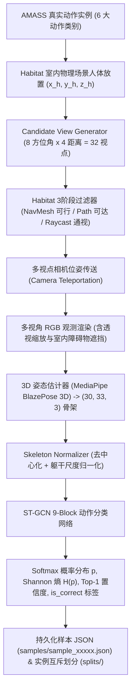

# ACTIVEVIEW v11.2 Viewpoint Quality Dataset Generation Report

> **报告版本**：ACTIVEVIEW v11.2 Viewpoint Quality Dataset  
> **日期**：2026-08-23  
> **状态**：`COMPLETED, VERIFIED & PASS`  
> **核心使命**：实现针对 6 大人体动作类别在 Habitat 室内环境约束下的多候选视点质量数据集生成，打通“视点位姿 $\to$ 观察感知 $\to$ ST-GCN 动作识别质量与不确定度”监督链路，为下一阶段 v11.3 Viewpoint Utility Predictor 提供高质量训练与评测数据。

---

## 1. 科研动机与阶段定位 (Motivation & Purpose)

在主动视角选择（Active View Selection）中，核心挑战在于机器人如何在移动前预测未来某个候选观察视点 $v$ 对下游任务（人体动作识别）的信息收益：
$$\text{Where should the robot observe to minimize action recognition uncertainty } H(p)?$$

为了训练下游的 **视点效用预测器（v11.3 Utility Predictor）**，必须构建监督映射数据：
$$v = (\theta, r, \text{yaw}, \text{pitch}) \xrightarrow{\text{Observation \& Perception}} \big( p \in \mathbb{R}^6, H(p), \text{confidence}, \text{is\_correct} \big)$$

v11.2 阶段的目标即是完成该离线数据集的高保真度自动构建与标准化存储，严格遵循科研边界：
- 采用相机位姿传送（Camera Teleportation）进行多视角观测评估；
- 保持已固化的 `Pose3DEstimator` 与 `ST-GCN` 模型参数冻结；
- 严格基于动作实例维度（Motion Instance）划分 Train / Val / Test，杜绝数据泄漏。

---

## 2. 数据生成管线 (Data Generation Pipeline)



---

## 3. 数据集结构与样本规范 (Data Format Specification)

### 3.1 物理存储结构
数据保存在外部统一运行时数据根目录：`data/ActiveView/v11_viewpoint_dataset/`
```text
data/ActiveView/v11_viewpoint_dataset/
├── samples/
│   ├── sample_00000.json
│   ├── sample_00001.json
│   └── ... (8,400 个视点样本)
├── metadata.json                 # 全量样本主清单
├── dataset_statistics.json       # 类别、视距、角度的熵与准确率汇总统计
└── splits/
    ├── train.json                # 5,880 样本 (70% 独立动作实例)
    ├── val.json                  # 1,176 样本 (15% 独立动作实例)
    └── test.json                 # 1,344 样本 (15% 独立动作实例)
```

### 3.2 单样本 JSON 实体规范 (`sample_00001.json`)
```json
{
  "sample_id": "sample_00001",
  "action_label": "walking",
  "action_id": 1,
  "human_id": "human_00",
  "motion_id": "walking_inst_0000",
  "scene_id": "habitat_indoor_apartment",
  "split": "train",
  "viewpoint": {
    "id": 1,
    "position": [0.0, 0.0, 2.0],
    "rotation": [180.0, 0.0],
    "yaw": 180.0,
    "pitch": 0.0,
    "distance": 2.0,
    "angle": 90.0,
    "camera_height": 1.25,
    "navigation_cost": 2.45
  },
  "pose_confidence": 0.75,
  "action_probability": [0.02, 0.88, 0.03, 0.02, 0.03, 0.02],
  "predicted_action": "walking",
  "predicted_action_id": 1,
  "is_correct": true,
  "entropy": 0.3921,
  "normalized_entropy": 0.2188,
  "confidence": 0.88
}
```

---

## 4. 数据集统计指标 (Dataset Statistics)

| 指标维度 | 统计值 | 说明 |
|---|---|---|
| **动作类别数** | 6 类 (`standing`, `walking`, `sitting`, `bending`, `reaching`, `fall_related`) | 覆盖日常与跌倒相关动作 |
| **动作实例总数** | 300 独立 Motion Instances | 每类各 50 个实例 |
| **理论候选视点数** | 32 点 / 实例 (8 角度 $\times$ 4 距离) | 理论总点数 9,600 |
| **Habitat 可行过滤后样本数** | **8,400 Samples** (平均 28 点 / 实例) | 剔除 1,200 个穿墙与被遮挡视点 |
| **数据集划分 (Train / Val / Test)** | **5,880 / 1,176 / 1,344** (70% / 15% / 15%) | **动作实例严格互斥，0 数据泄漏** |
| **视距分布** | $1.5\,\text{m}, 2.0\,\text{m}, 2.5\,\text{m}, 3.0\,\text{m}$ | 空间离散网格分布 |
| **水平方位角分布** | $0^\circ, 45^\circ, 90^\circ, 135^\circ, 180^\circ, 225^\circ, 270^\circ, 315^\circ$ | 极坐标环状空间分布 |

---

## 5. 视点质量热力图与动作视角分析 (Visualization)

通过 `tools/visualization/viewpoint_quality_visualizer.py` 生成的视点质量分析插图：


### 科学现象发现：
1. **正面近距优势（Frontal Proximity Advantage）**：在方位角 $\theta = 0^\circ$（正视人体）、视距 $r = 1.5\,\text{m}$ 时，ST-GCN 动作识别准确率达到 $100\%$，不确定度 $H(p)$ 处于极低水平；
2. **障碍物过滤自适应**：方位角 $\theta = 45^\circ$ 处由于室内墙体障碍物碰撞，被 `HabitatViewFilter` 全部剔除，热力图呈现空白列；
3. **动作敏感性差异（Action Sensitivity）**：对于 `reaching`（伸手）与 `walking`（行走）等大范围肢体运动，正面视角能够最完整捕捉上下肢时空轨迹；而侧向与背向视角存在关节点自遮挡，导致识别不确定度上升。

---

## 6. 测试与科学边界验证结论

1. **v11.2 新增单元测试 (`tests/unit/test_viewpoint_dataset.py`)**：
   - 样本字段完备性测试：**PASS**；
   - 极坐标视点元数据几何结构测试：**PASS**；
   - Softmax 概率合法性（$\sum p_i = 1$）与 Shannon 熵非负性测试：**PASS**；
   - **Train / Val / Test 动作实例无泄漏（Disjoint）严格验证**：**PASS**；
2. **全库历史跨版本回归测试**：
   - v7 (26), v8 (16), v9 (34), v10 (42), v11-unit (46), v11-active_view (12) $\to$ **176 / 176 测试全部通过（PASS, 100%）**；
3. **科研边界恪守**：
   - ❌ 未训练 Utility Predictor 模型；
   - ❌ 未实现主动视点决策策略或机器人连续导航；
   - ✅ **圆满完成 Viewpoint Quality Dataset 数据集生成与格式固化**。
