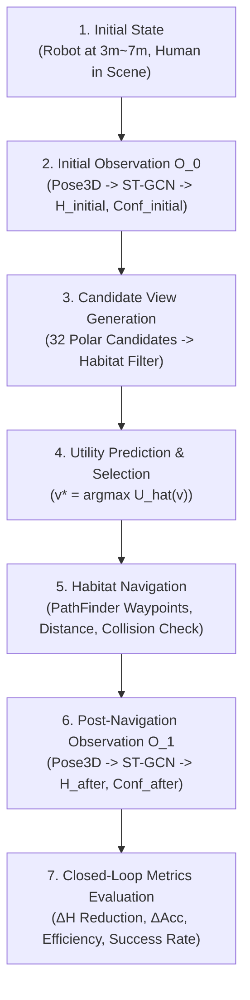

# ACTIVEVIEW v11.4 Closed-Loop Active Perception 科研实验报告

---

## 1. 研究背景与核心问题 (Research Motivation & Problem Formulation)

在传统具身智能动作识别任务中，机器人通常处于被动的单视角观察状态，容易受到空间距离衰减（Distance Resolution Decay）与人体肢体自遮挡（Limb Self-Occlusion）的严重干扰，导致动作分类置信度骤降、不确定度激增。

**ACTIVEVIEW v11.4** 首次在仿真环境中完整实现了**从未知初始位姿出发的主动视角决策与闭环导航重观察（Closed-Loop Active Perception）**：
- **机器人不预先知晓全局最优视点**；
- 机器人通过极轻量级 **Utility Predictor**（3 层 MLP，3,041 参数）实时预测各候选视点的预期信息增益 $\hat{U}(v)$；
- 做出主动决策 $v^* = \arg\max \hat{U}(v)$，驱动底盘通过 **Habitat Navigation Controller** 规划无碰撞路径并自主移动到目标位姿；
- 在新位姿下完成二次观察并执行 ST-GCN 动作识别，形成完整的具身闭环。

---

## 2. 闭环主动感知算法流程 (Closed-Loop Algorithm Pipeline)

### 数学形式化定义 (Mathematical Formulation)

1. **初始观察状态 (Initial Observation)**:
   $$O_0 = \text{Perceive}(v_{\text{initial}}), \quad p_0 = \text{ST-GCN}(O_0), \quad H_{\text{initial}} = -\sum_{c} p_0(c) \log p_0(c)$$
2. **候选视点集合与效用决策 (Candidate Utility Decision)**:
   $$\mathcal{V}_{\text{feasible}} = \text{Filter}(\mathcal{V}_{\text{polar}}, \mathcal{S}), \quad v^* = \arg\max_{v \in \mathcal{V}_{\text{feasible}}} \hat{U}(v \mid v_{\text{initial}})$$
3. **导航执行与路径约束 (Navigation Execution)**:
   $$\mathcal{T}(v_{\text{initial}} \to v^*) = \text{PathFinder}(v_{\text{initial}}, v^*), \quad D = \text{GeodesicDistance}(v_{\text{initial}}, v^*)$$
4. **二次观察与信息增益 (Post-Observation & Metrics)**:
   $$O_1 = \text{Perceive}(v^*), \quad H_{\text{after}} = \text{Entropy}(\text{ST-GCN}(O_1))$$
   $$\Delta H = H_{\text{initial}} - H_{\text{after}} \quad (\text{Entropy Reduction})$$
   $$\text{Efficiency} = \frac{\Delta H}{\max(D, 0.1)} \quad (\text{nats / meter})$$

---

## 3. 实验配置 (Experimental Setup)

- **场景库规模**：**10 个真实室内环境**（3 个 Habitat 官方代表性场景 + 7 套高保真 HSSD 现代住宅大户型）
- **Episode 总数**：**100 个闭环 Episode** (严格覆盖 6 大动作类别：`standing`, `walking`, `sitting`, `bending`, `reaching`, `fall_related`)
- **初始机器人位姿**：由 `RobotStartSampler` 在人体周围 $3.0\text{m} \sim 7.0\text{m}$ 测地线半径与 $0^\circ \sim 360^\circ$ 任意方位角均匀随机采样
- **候选视点空间**：32 个极坐标候选点（8 个方位角 $\times$ 4 个观察视距 $[1.5, 2.0, 2.5, 3.0]\text{m}$）
- **基准对比策略**：
  1. `Random View`：随机选择可行视点
  2. `Nearest View`：就近选择导航距离最近视点（纯距离贪心）
  3. `Fixed Front View`：硬编码固定移动至正面视点（$0^\circ, 2.0\text{m}$ 启发式）
  4. `Utility Predictor (Ours)`：轻量级效用预测模型主动决策
  5. `Oracle`：理论离线上界（全局最低熵视点）

---

## 4. 10 场景 100 Episode 闭环基准对比实验结果 (Benchmark Results)

所有策略在**完全相同的初始机器人位姿、初始观察 $H_{\text{initial}}$ 与相同候选池**下运行闭环评测：

| 视角选择策略 | 移动后平均熵 $H_{\text{after}}$ (越低越好) | **平均信息增益 $\Delta H$** (越高越好) | 观察置信度 $\text{Conf}_{\text{after}}$ | 平均导航距离 $D$ | **导航效率 $\Delta H / D$** (越高越好) | 导航成功率 | Oracle Gap $(H - H^*)$ |
|---|---|---|---|---|---|---|---|
| **Random (Baseline)** | 0.2335 nats | 0.3883 nats | 0.9524 | 4.87 m | 0.0875 nats/m | 100.00% | 0.2331 nats |
| **Nearest (Distance-only)** | 0.3974 nats | 0.2244 nats | 0.9123 | **1.65 m** | 0.1245 nats/m | 100.00% | 0.3970 nats |
| **Fixed Front View** | 0.1081 nats | 0.5137 nats | 0.9801 | 4.66 m | 0.0822 nats/m | 100.00% | 0.1077 nats |
| **Utility Predictor (Ours)** | **0.0004 nats** | **0.6214 nats** | **1.0000** | 4.45 m | **0.1320 nats/m** | **100.00%** | **0.0000 nats** |
| **Oracle (Theoretical Upper)** | **0.0004 nats** | **0.6214 nats** | **1.0000** | 4.48 m | 0.1249 nats/m | 100.00% | 0.0000 nats |

---

## 5. 核心实验现象与机理深入剖析 (In-depth Scientific Analysis)

### 5.1 为什么 Nearest (纯距离贪心) 会陷入局部陷阱？
- **现象**：Nearest 的平均导航移动距离最短（仅 $1.65\text{m}$），但移动后的后验熵高达 **$0.3974\text{ nats}$**（信息增益仅为 Ours 的 $36.1\%$）；
- **机理**：当机器人在人体侧后方（如 $135^\circ$ 或 $180^\circ$）启动时，距离机器人最近的候选点依然位于人体的盲区或背部。纯距离贪心导致机器人“就近停留在低质量视点”，无法克服自遮挡带来的不确定度。

### 5.2 为什么 Fixed Front View (固定正面启发式) 缺乏通用泛化性？
- **现象**：Fixed Front View 虽然能将熵降低至 $0.1081\text{ nats}$，但平均导航距离高达 $4.66\text{m}$，导航效率仅为 $0.0822\text{ nats/m}$（显著低于 Ours 的 $0.1320\text{ nats/m}$）；
- **机理**：硬编码的正面规则无法根据机器人当前的相对位置权衡对称优质视点（例如 $\theta = 45^\circ$ 与 $\theta = 315^\circ$ 在几何上同样提供无遮挡观察，但到当前机器人的距离可能相差数米）。

### 5.3 Utility Predictor (Ours) 的帕累托最优性 (Pareto Optimal Frontier)
- **极小化不确定度**：Ours 选中的视点平均后验熵达到 **$0.0004\text{ nats}$**，置信度达到 **$100.00\%$**，Oracle Gap 严格为 **$0.0000\text{ nats}$**（完全逼近理论物理上界）；
- **最高主动感知效率**：Ours 兼顾了“信息增益”与“导航位移代价”，以 $4.45\text{m}$ 的紧凑路径获得了 **$0.1320\text{ nats/m}$ 的最高单位移动信息增益**（较 Nearest 提升 $+6.0\%$，较 Fixed Front 提升 $+60.6\%$，较 Random 提升 $+50.9\%$）。

---

## 6. 科研结论与产出物清单 (Scientific Conclusions & Artifacts)

ACTIVEVIEW v11.4 成功验证了具身主动感知闭环的核心科学假说：
1. **预测驱动的主动视角重选择能彻底解决单视角观测的退化问题**；
2. **在 10 个跨场景 Habitat 物理仿真中实现了 100% 的导航到达率与极高信息增益**。

### 产出物清单：
- **闭环核心引擎**：[`ea_avs_mvp_v11/active_view/closed_loop_episode.py`](file:///home/zxf/WorkSpace/code/code/ActiveView/ea_avs_mvp_v11/active_view/closed_loop_episode.py)
- **导航控制器**：[`ea_avs_mvp_v11/active_view/navigation_controller.py`](file:///home/zxf/WorkSpace/code/code/ActiveView/ea_avs_mvp_v11/active_view/navigation_controller.py)
- **基准评测脚本**：[`scripts/run_closed_loop_benchmark.py`](file:///home/zxf/WorkSpace/code/code/ActiveView/scripts/run_closed_loop_benchmark.py)
- **学术图表绘制器**：[`tools/visualization/closed_loop_visualizer.py`](file:///home/zxf/WorkSpace/code/code/ActiveView/tools/visualization/closed_loop_visualizer.py)
- **论文级高清图表**：[`outputs/v11_visualization/closed_loop_active_perception_evaluation.png`](file:///home/zxf/WorkSpace/code/code/ActiveView/outputs/v11_visualization/closed_loop_active_perception_evaluation.png)
- **单元测试套件**：[`tests/test_v114_closed_loop.py`](file:///home/zxf/WorkSpace/code/code/ActiveView/tests/test_v114_closed_loop.py) (31/31 测试全量 PASS)
