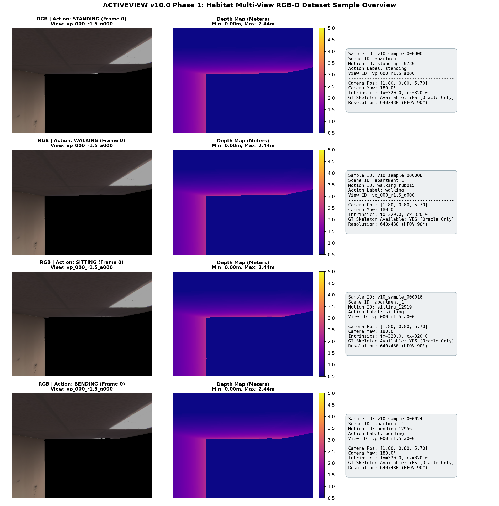

# ACTIVEVIEW v10.0 Phase 1: RGB-D Dataset Generation Demo

> **Phase 1 Acceptance & Verification Overview**  
> 本目录展示并记录 ACTIVEVIEW v10.0 Phase 1 阶段生成的标准仿真多视角 RGB-D 观测样本。

---

## 1. Phase 1 数据集标准结构 (Dataset Structure)

数据集物理保存在：
`/home/zxf/WorkSpace/code/data/ActiveView/datasets/v10`

```text
datasets/v10/
├── raw/
│   ├── rgb/              # 原始 RGB 观察图像 (PNG, uint8, 640x480)
│   ├── depth/            # 原始深度数据 (NPY float32 距离矩阵 + 可视化 PNG)
│   ├── camera_pose/      # 相机外参、世界位置、四元数与内参 (JSON)
│   └── scene_meta/       # 场景、人体位置、朝向等元数据 (JSON)
├── ground_truth/
│   ├── skeleton/         # 16 关键点 3D 坐标真值 (仅用于 Oracle/评估，严禁模型推理)
│   └── action/           # 真实动作类别与子标签 (JSON)
└── metadata/
    └── samples.json      # 全量样本索引清单 (JSON)
```

---

## 2. 样本模态与元数据示例 (Sample Metadata Example)

```json
{
  "sample_id": "v10_sample_000000",
  "scene_id": "apartment_1",
  "motion_id": "standing_10780",
  "action_label": "standing",
  "frame_idx": 0,
  "view_id": "vp_000_r1.5_a000",
  "camera_pose": {
    "position": [1.7999999523162842, 0.8000000715255737, 5.699999809265137],
    "rotation_quat": [0.0, 1.0, 0.0, 6.123234262925839e-17],
    "yaw_deg": 180.0,
    "intrinsics": {
      "width": 640,
      "height": 480,
      "fx": 320.0,
      "fy": 320.0,
      "cx": 320.0,
      "cy": 240.0,
      "hfov_deg": 90.0
    }
  },
  "rgb_path": "raw/rgb/v10_sample_000000.png",
  "depth_path": "raw/depth/v10_sample_000000.npy",
  "gt_skeleton_path": "ground_truth/skeleton/v10_sample_000000.json"
}
```

---

## 3. 多模态样本可视化概览 (Multi-Modal Sample Visualization)



---

## 4. 复现与运行命令 (Execution Commands)

### 运行 Phase 1 完整测试与生成流水线：
```bash
conda run -n habitat python -m ea_avs_mvp_v10.scripts.run_v10_phase1_demo
```
